# Material experiment plots

Generated reproducibly from `../results` by:

```powershell
python -m pip install -r scripts/material_experiments/plot_requirements.txt
python scripts/material_experiments/plot_results.py
```

The script deletes only its generated `plots/data`, `plots/png`, and `plots/svg` directories before rebuilding them. Failed and skipped rows are listed in `data/failed_skipped_cases.csv` and are never treated as measurements.

## Campaign summary

- Configs: 18
- Expected runs: 396
- Success: 396
- Salvaged: 0
- Failed: 0
- Skipped: 0
- Quality audit: **passed**

## Quality notes

- 4/5 sampled Sponza and SponzaIvy capture frames are byte-identical on the current camera path; the assets and timings differ, but visibly distinct ivy was not captured.

## Plot index

### 00_smoke_synthetic_material_grid — per-experiment result

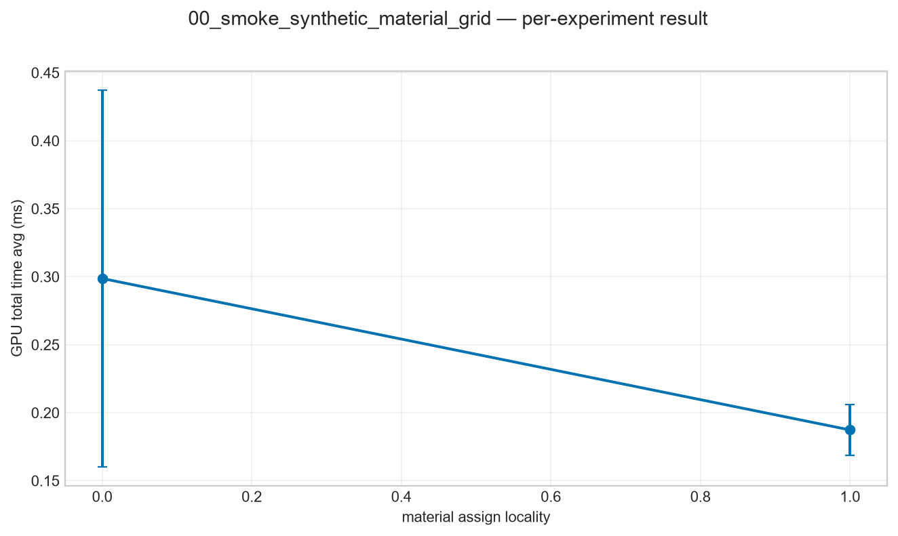

- Inputs: `00_smoke_synthetic_material_grid.json`
- Filters: runner_status=success; no failed/skipped rows plotted
- X axis: param_material_assign_locality
- Series: all runs
- SVG: [experiment_00_smoke_synthetic_material_grid.svg](svg/experiment_00_smoke_synthetic_material_grid.svg)

### 01_smoke_real_pbr_feature — per-experiment result

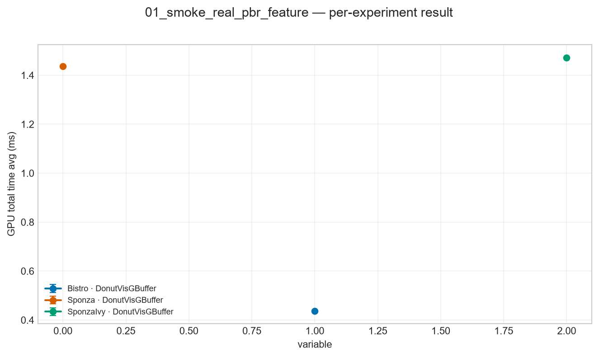

- Inputs: `01_smoke_real_pbr_feature.json`
- Filters: runner_status=success; no failed/skipped rows plotted
- X axis: param_variable
- Series: Bistro · DonutVisGBuffer; Sponza · DonutVisGBuffer; SponzaIvy · DonutVisGBuffer
- SVG: [experiment_01_smoke_real_pbr_feature.svg](svg/experiment_01_smoke_real_pbr_feature.svg)

### 10_synth_locality_fixed64 — per-experiment result

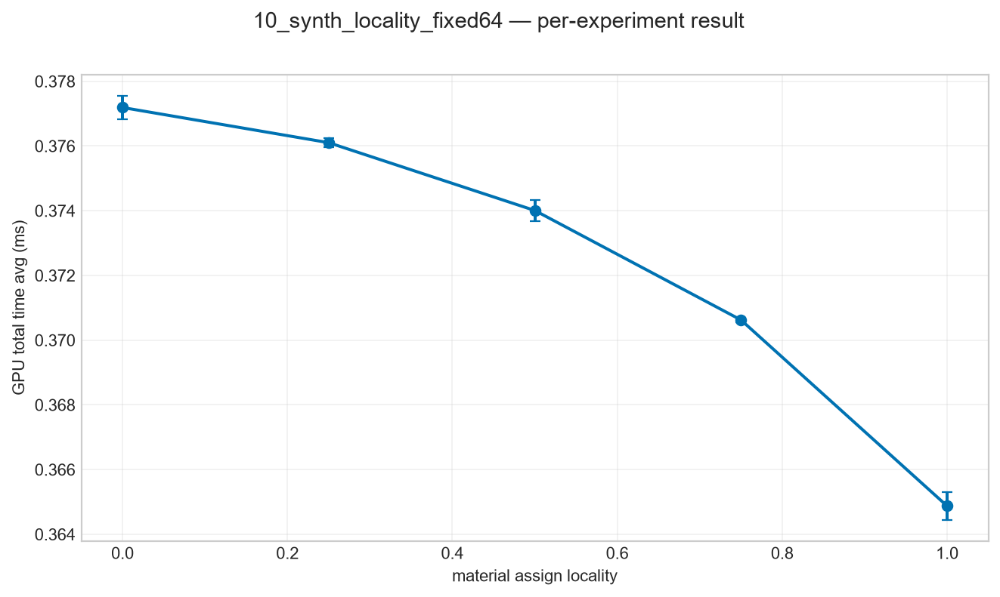

- Inputs: `10_synth_locality_fixed64.json`
- Filters: runner_status=success; no failed/skipped rows plotted
- X axis: param_material_assign_locality
- Series: all runs
- SVG: [experiment_10_synth_locality_fixed64.svg](svg/experiment_10_synth_locality_fixed64.svg)

### 11_synth_diversity_fixed64 — per-experiment result

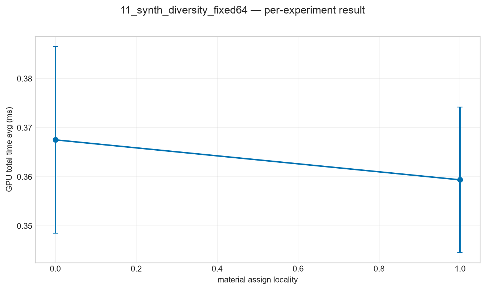

- Inputs: `11_synth_diversity_fixed64.json`
- Filters: runner_status=success; no failed/skipped rows plotted
- X axis: param_material_assign_locality
- Series: all runs
- SVG: [experiment_11_synth_diversity_fixed64.svg](svg/experiment_11_synth_diversity_fixed64.svg)

### 12_synth_locality_diversity_map_fixed64 — per-experiment result

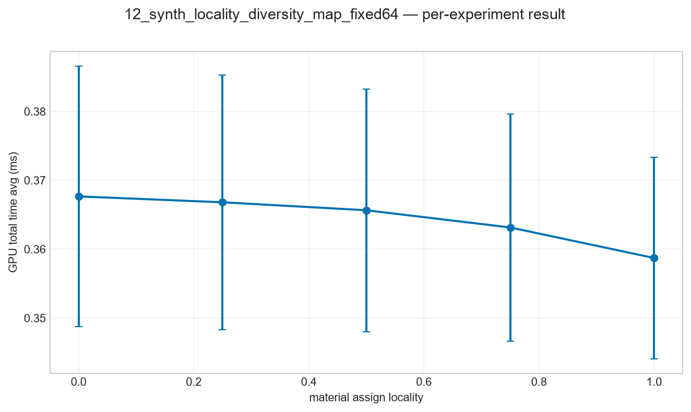

- Inputs: `12_synth_locality_diversity_map_fixed64.json`
- Filters: runner_status=success; no failed/skipped rows plotted
- X axis: param_material_assign_locality
- Series: all runs
- SVG: [experiment_12_synth_locality_diversity_map_fixed64.svg](svg/experiment_12_synth_locality_diversity_map_fixed64.svg)

### 13_synth_open_bin_count_diagnostic — per-experiment result

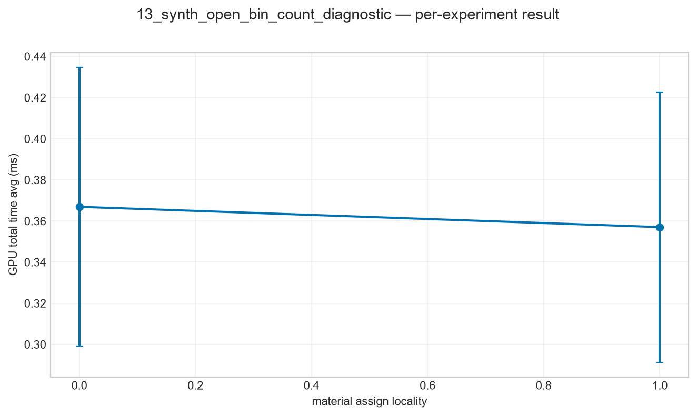

- Inputs: `13_synth_open_bin_count_diagnostic.json`
- Filters: runner_status=success; no failed/skipped rows plotted
- X axis: param_material_assign_locality
- Series: all runs
- SVG: [experiment_13_synth_open_bin_count_diagnostic.svg](svg/experiment_13_synth_open_bin_count_diagnostic.svg)

### 14_synth_workload_scaling — per-experiment result

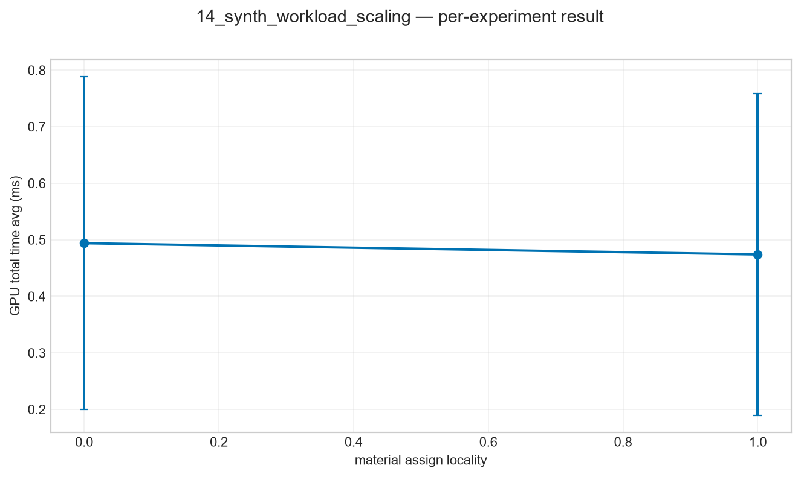

- Inputs: `14_synth_workload_scaling.json`
- Filters: runner_status=success; no failed/skipped rows plotted
- X axis: param_material_assign_locality
- Series: all runs
- SVG: [experiment_14_synth_workload_scaling.svg](svg/experiment_14_synth_workload_scaling.svg)

### 15_synth_seed_robustness — per-experiment result

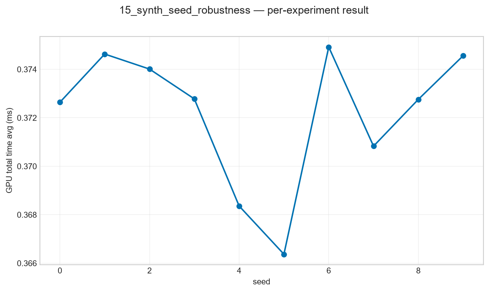

- Inputs: `15_synth_seed_robustness.json`
- Filters: runner_status=success; no failed/skipped rows plotted
- X axis: param_seed
- Series: all runs
- SVG: [experiment_15_synth_seed_robustness.svg](svg/experiment_15_synth_seed_robustness.svg)

### 16_synth_renderer_compare_selected — per-experiment result

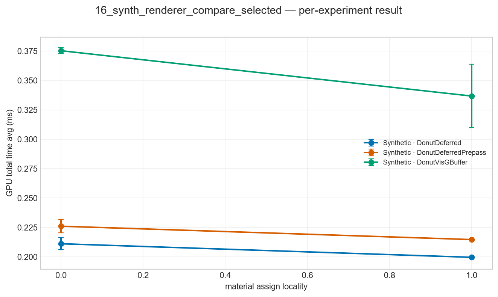

- Inputs: `16_synth_renderer_compare_selected.json`
- Filters: runner_status=success; no failed/skipped rows plotted
- X axis: param_material_assign_locality
- Series: Synthetic · DonutDeferred; Synthetic · DonutDeferredPrepass; Synthetic · DonutVisGBuffer
- SVG: [experiment_16_synth_renderer_compare_selected.svg](svg/experiment_16_synth_renderer_compare_selected.svg)

### 20_real_random_bin_count_quick_all_scenes — per-experiment result

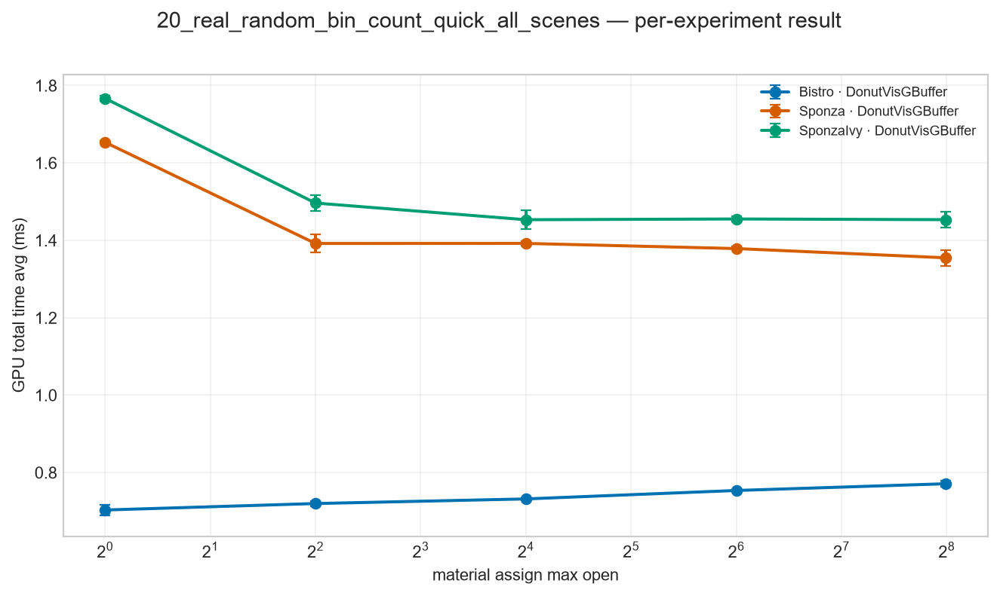

- Inputs: `20_real_random_bin_count_quick_all_scenes.json`
- Filters: runner_status=success; no failed/skipped rows plotted
- X axis: param_material_assign_max_open
- Series: Bistro · DonutVisGBuffer; Sponza · DonutVisGBuffer; SponzaIvy · DonutVisGBuffer
- SVG: [experiment_20_real_random_bin_count_quick_all_scenes.svg](svg/experiment_20_real_random_bin_count_quick_all_scenes.svg)

### 21_real_random_diversity_quick_all_scenes — per-experiment result

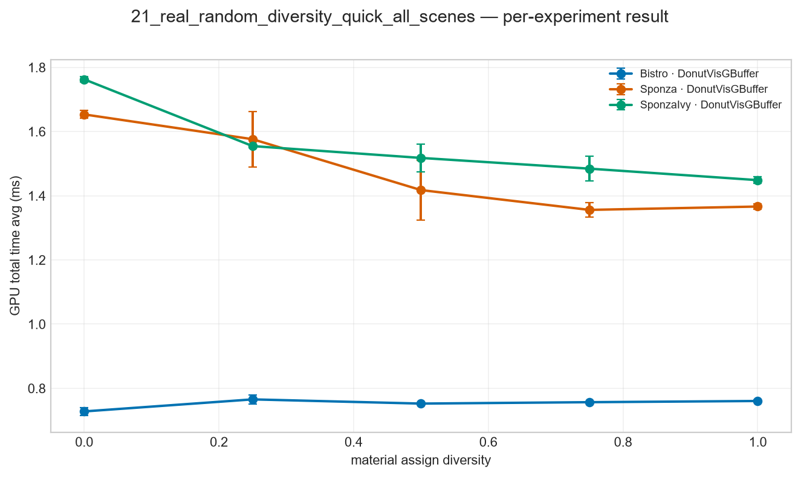

- Inputs: `21_real_random_diversity_quick_all_scenes.json`
- Filters: runner_status=success; no failed/skipped rows plotted
- X axis: param_material_assign_diversity
- Series: Bistro · DonutVisGBuffer; Sponza · DonutVisGBuffer; SponzaIvy · DonutVisGBuffer
- SVG: [experiment_21_real_random_diversity_quick_all_scenes.svg](svg/experiment_21_real_random_diversity_quick_all_scenes.svg)

### 22_real_pbr_feature_renderer_compare_full — per-experiment result

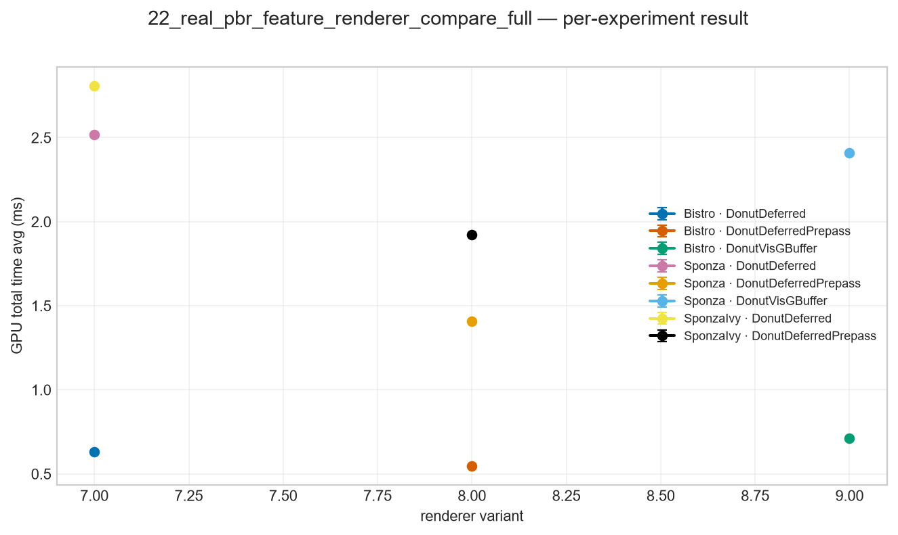

- Inputs: `22_real_pbr_feature_renderer_compare_full.json`
- Filters: runner_status=success; no failed/skipped rows plotted
- X axis: param_renderer_variant
- Series: Bistro · DonutDeferred; Bistro · DonutDeferredPrepass; Bistro · DonutVisGBuffer; Sponza · DonutDeferred; Sponza · DonutDeferredPrepass; Sponza · DonutVisGBuffer; SponzaIvy · DonutDeferred; SponzaIvy · DonutDeferredPrepass; SponzaIvy · DonutVisGBuffer
- SVG: [experiment_22_real_pbr_feature_renderer_compare_full.svg](svg/experiment_22_real_pbr_feature_renderer_compare_full.svg)

### 23_real_random_selected_renderer_compare_quick — per-experiment result

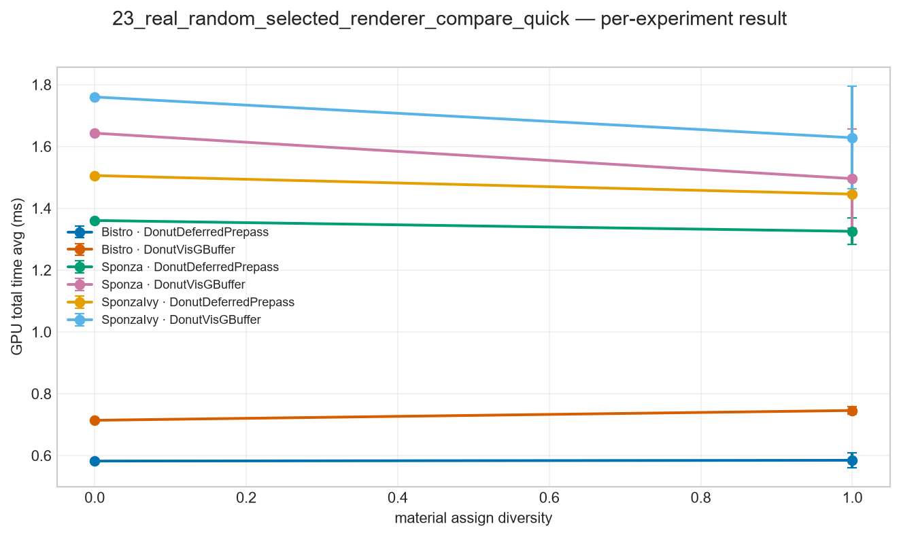

- Inputs: `23_real_random_selected_renderer_compare_quick.json`
- Filters: runner_status=success; no failed/skipped rows plotted
- X axis: param_material_assign_diversity
- Series: Bistro · DonutDeferredPrepass; Bistro · DonutVisGBuffer; Sponza · DonutDeferredPrepass; Sponza · DonutVisGBuffer; SponzaIvy · DonutDeferredPrepass; SponzaIvy · DonutVisGBuffer
- SVG: [experiment_23_real_random_selected_renderer_compare_quick.svg](svg/experiment_23_real_random_selected_renderer_compare_quick.svg)

### 24_real_resolution_scaling_pbr_quick — per-experiment result

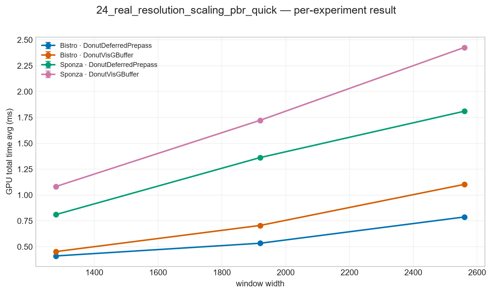

- Inputs: `24_real_resolution_scaling_pbr_quick.json`
- Filters: runner_status=success; no failed/skipped rows plotted
- X axis: param_window_width
- Series: Bistro · DonutDeferredPrepass; Bistro · DonutVisGBuffer; Sponza · DonutDeferredPrepass; Sponza · DonutVisGBuffer
- SVG: [experiment_24_real_resolution_scaling_pbr_quick.svg](svg/experiment_24_real_resolution_scaling_pbr_quick.svg)

### 25_real_texture_vfc_ablation_quick — per-experiment result

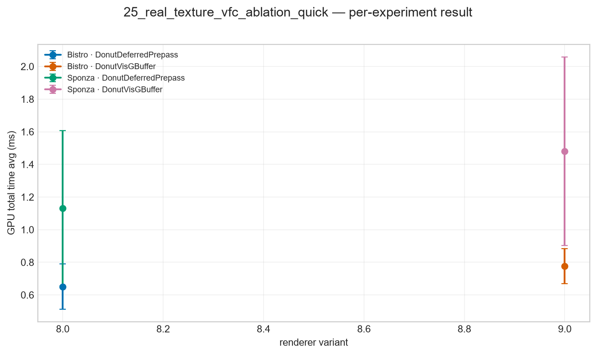

- Inputs: `25_real_texture_vfc_ablation_quick.json`
- Filters: runner_status=success; no failed/skipped rows plotted
- X axis: param_renderer_variant
- Series: Bistro · DonutDeferredPrepass; Bistro · DonutVisGBuffer; Sponza · DonutDeferredPrepass; Sponza · DonutVisGBuffer
- SVG: [experiment_25_real_texture_vfc_ablation_quick.svg](svg/experiment_25_real_texture_vfc_ablation_quick.svg)

### 30_final_selected_full_camera — per-experiment result

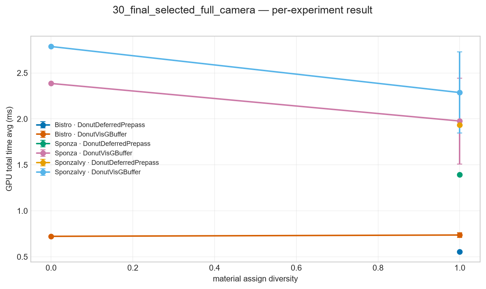

- Inputs: `30_final_selected_full_camera.json`
- Filters: runner_status=success; no failed/skipped rows plotted
- X axis: param_material_assign_diversity
- Series: Bistro · DonutDeferredPrepass; Bistro · DonutVisGBuffer; Sponza · DonutDeferredPrepass; Sponza · DonutVisGBuffer; SponzaIvy · DonutDeferredPrepass; SponzaIvy · DonutVisGBuffer
- SVG: [experiment_30_final_selected_full_camera.svg](svg/experiment_30_final_selected_full_camera.svg)

### 31_capture_representative_frames — per-experiment result

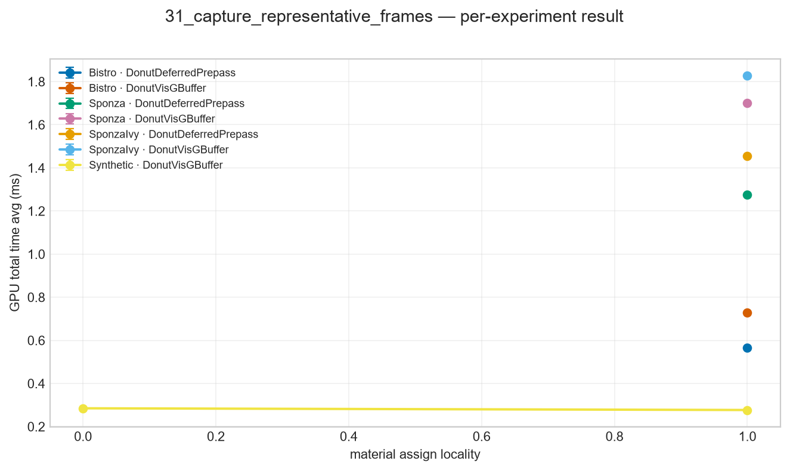

- Inputs: `31_capture_representative_frames.json`
- Filters: runner_status=success; no failed/skipped rows plotted
- X axis: param_material_assign_locality
- Series: Bistro · DonutDeferredPrepass; Bistro · DonutVisGBuffer; Sponza · DonutDeferredPrepass; Sponza · DonutVisGBuffer; SponzaIvy · DonutDeferredPrepass; SponzaIvy · DonutVisGBuffer; Synthetic · DonutVisGBuffer
- SVG: [experiment_31_capture_representative_frames.svg](svg/experiment_31_capture_representative_frames.svg)

### 32_nsight_representative_cases — per-experiment result

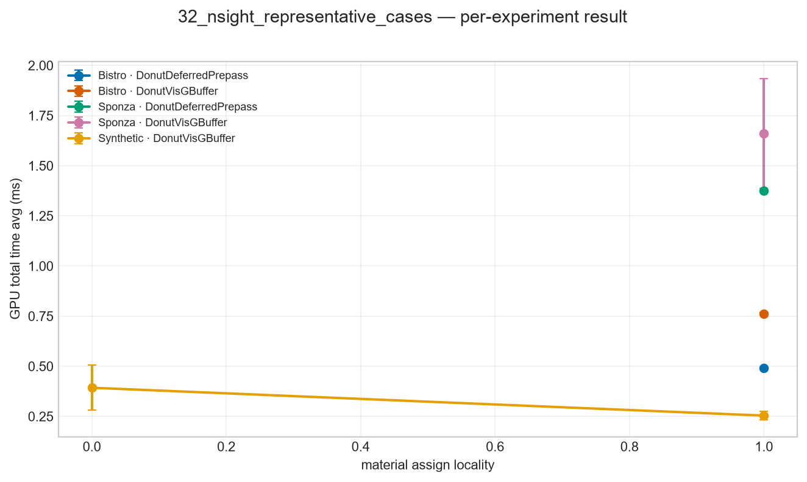

- Inputs: `32_nsight_representative_cases.json`
- Filters: runner_status=success; no failed/skipped rows plotted
- X axis: param_material_assign_locality
- Series: Bistro · DonutDeferredPrepass; Bistro · DonutVisGBuffer; Sponza · DonutDeferredPrepass; Sponza · DonutVisGBuffer; Synthetic · DonutVisGBuffer
- SVG: [experiment_32_nsight_representative_cases.svg](svg/experiment_32_nsight_representative_cases.svg)

### Synthetic locality change

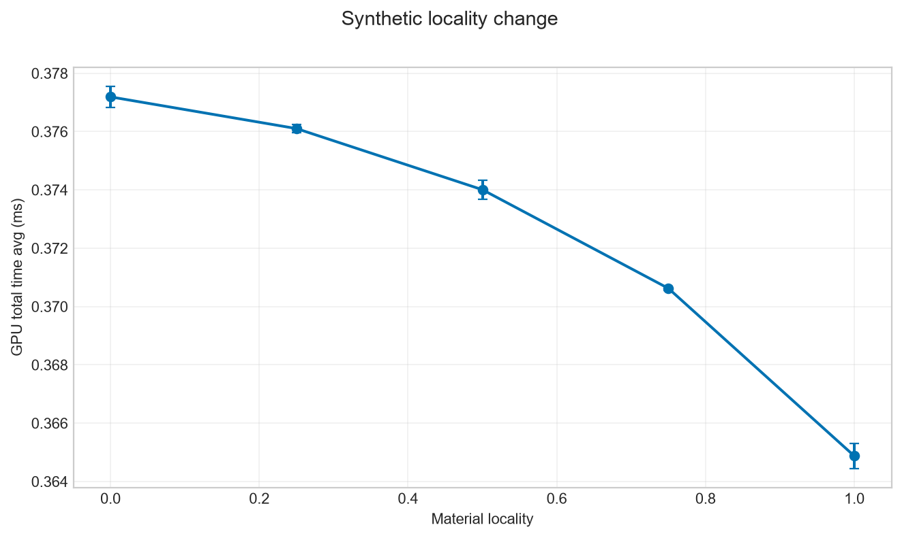

- Inputs: `10_synth_locality_fixed64.json`
- Filters: three seeds; diversity=1; success rows
- X axis: param_material_assign_locality
- Series: 64 open classes
- SVG: [locality_change.svg](svg/locality_change.svg)

### Synthetic diversity change

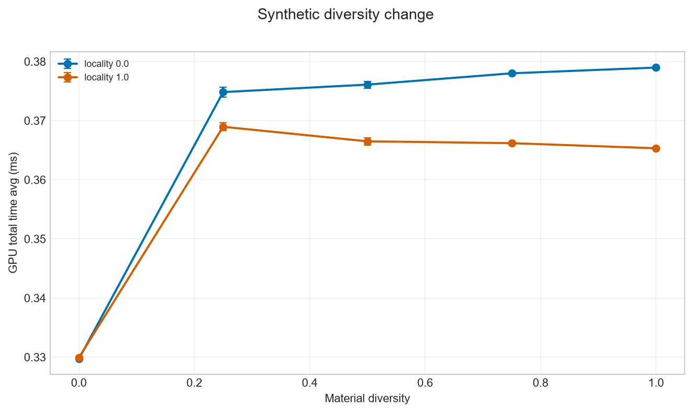

- Inputs: `11_synth_diversity_fixed64.json`
- Filters: three seeds; 64 open classes; success rows
- X axis: param_material_assign_diversity
- Series: locality 0.0; locality 1.0
- SVG: [diversity_change.svg](svg/diversity_change.svg)

### Synthetic locality × diversity map (64 open classes)

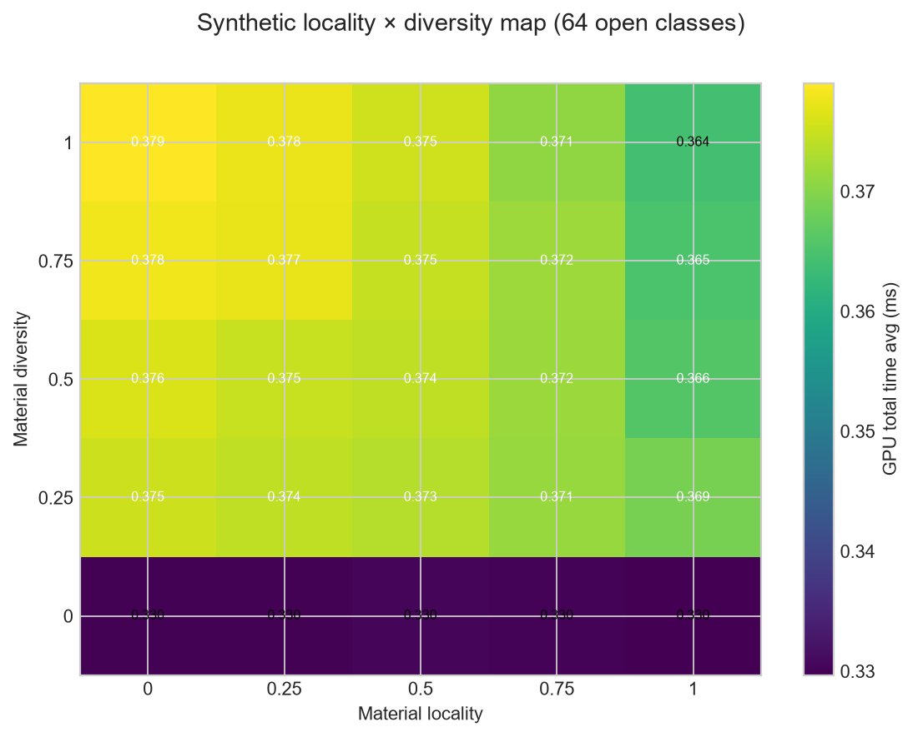

- Inputs: `12_synth_locality_diversity_map_fixed64.json`
- Filters: three seeds averaged; runner_status=success
- X axis: material_assign_locality
- Series: heatmap rows=material_assign_diversity
- SVG: [locality_diversity_heatmap.svg](svg/locality_diversity_heatmap.svg)

### Synthetic material/open-bin class count

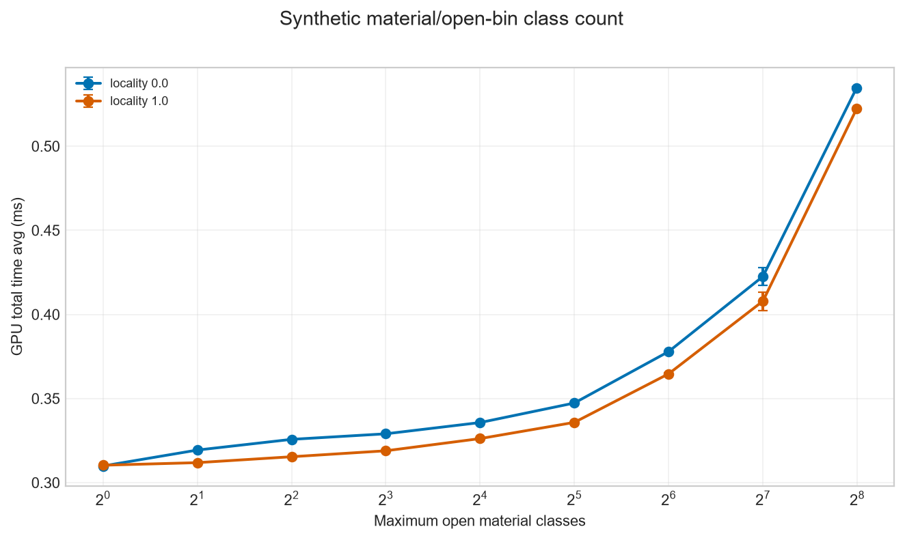

- Inputs: `13_synth_open_bin_count_diagnostic.json`
- Filters: three seeds; diversity=1; success rows
- X axis: param_material_assign_max_open
- Series: locality 0.0; locality 1.0
- SVG: [open_bin_class_count.svg](svg/open_bin_class_count.svg)

### Synthetic workload scaling

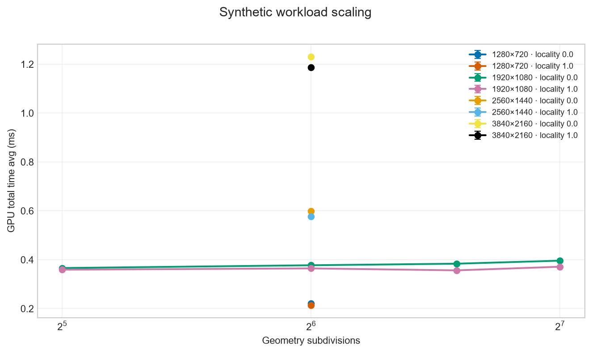

- Inputs: `14_synth_workload_scaling.json`
- Filters: success rows; full configured resolution/locality matrix
- X axis: param_geometry_div
- Series: 1280×720 · locality 0.0; 1280×720 · locality 1.0; 1920×1080 · locality 0.0; 1920×1080 · locality 1.0; 2560×1440 · locality 0.0; 2560×1440 · locality 1.0; 3840×2160 · locality 0.0; 3840×2160 · locality 1.0
- SVG: [workload_scaling.svg](svg/workload_scaling.svg)

### Synthetic seed robustness

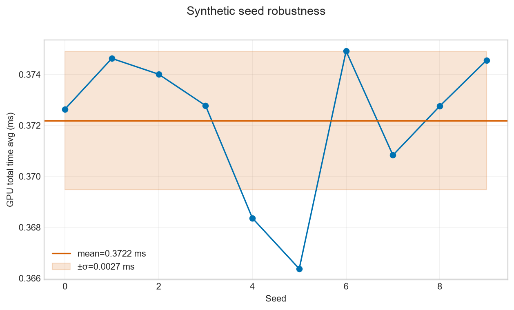

- Inputs: `15_synth_seed_robustness.json`
- Filters: fixed locality=0.5, diversity=0.5; success rows only
- X axis: seed
- Series: individual seed, mean, population std
- SVG: [seed_robustness.svg](svg/seed_robustness.svg)

### Renderer comparison — synthetic and real scenes

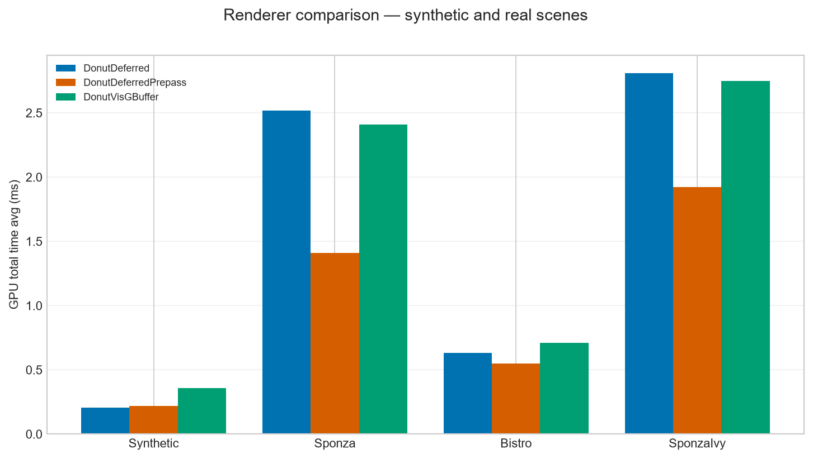

- Inputs: `16_synth_renderer_compare_selected.json;22_real_pbr_feature_renderer_compare_full.json`
- Filters: success rows; synthetic selected conditions and real full-camera PBR
- X axis: scene class
- Series: renderer_name
- SVG: [renderer_comparison.svg](svg/renderer_comparison.svg)

### Real-scene material/open-bin count

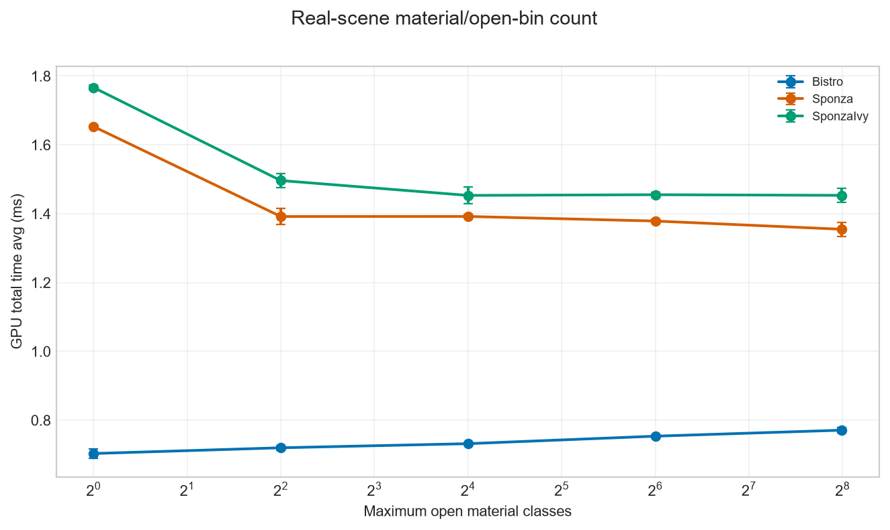

- Inputs: `20_real_random_bin_count_quick_all_scenes.json`
- Filters: three seeds; success rows
- X axis: param_material_assign_max_open
- Series: Bistro; Sponza; SponzaIvy
- SVG: [real_bin_count.svg](svg/real_bin_count.svg)

### Real-scene material diversity

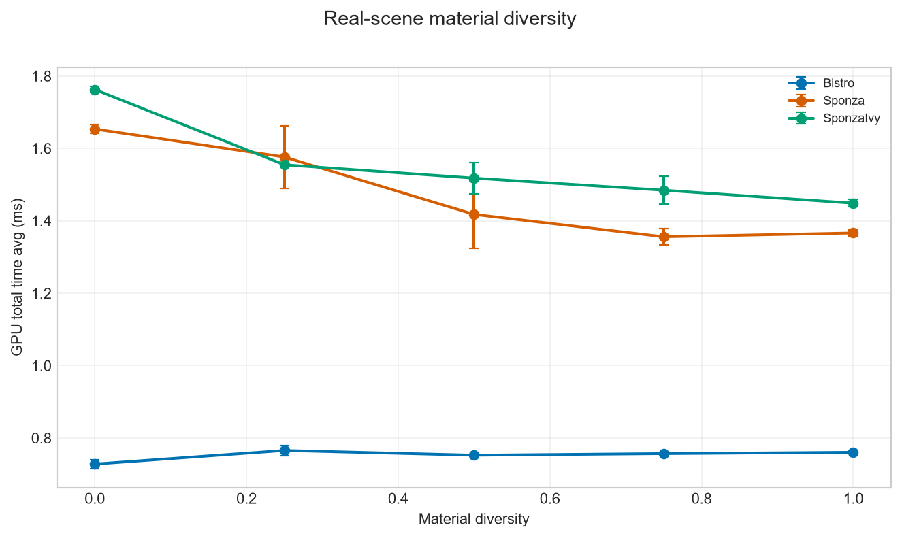

- Inputs: `21_real_random_diversity_quick_all_scenes.json`
- Filters: three seeds; max open=255; success rows
- X axis: param_material_assign_diversity
- Series: Bistro; Sponza; SponzaIvy
- SVG: [real_diversity.svg](svg/real_diversity.svg)

### Real-scene resolution scaling

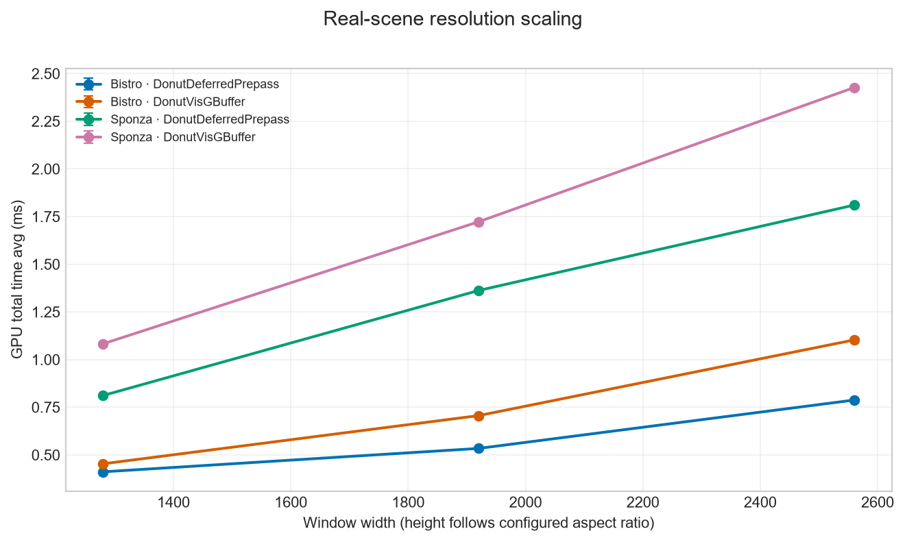

- Inputs: `24_real_resolution_scaling_pbr_quick.json`
- Filters: PBR, texture=true, VFC=true, success rows
- X axis: param_window_width
- Series: Bistro · DonutDeferredPrepass; Bistro · DonutVisGBuffer; Sponza · DonutDeferredPrepass; Sponza · DonutVisGBuffer
- SVG: [resolution_scaling.svg](svg/resolution_scaling.svg)

### Texture loading / view-frustum culling ablation

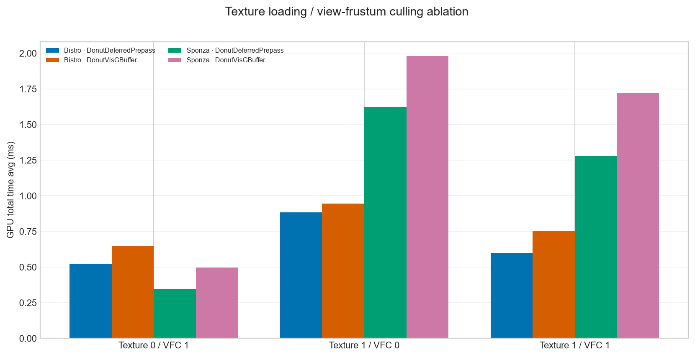

- Inputs: `25_real_texture_vfc_ablation_quick.json`
- Filters: success rows; all configured 2×2 ablation combinations
- X axis: to_load_texture × use_vfc
- Series: scene × renderer
- SVG: [texture_vfc_ablation.svg](svg/texture_vfc_ablation.svg)

### Scene comparison across real-scene experiments

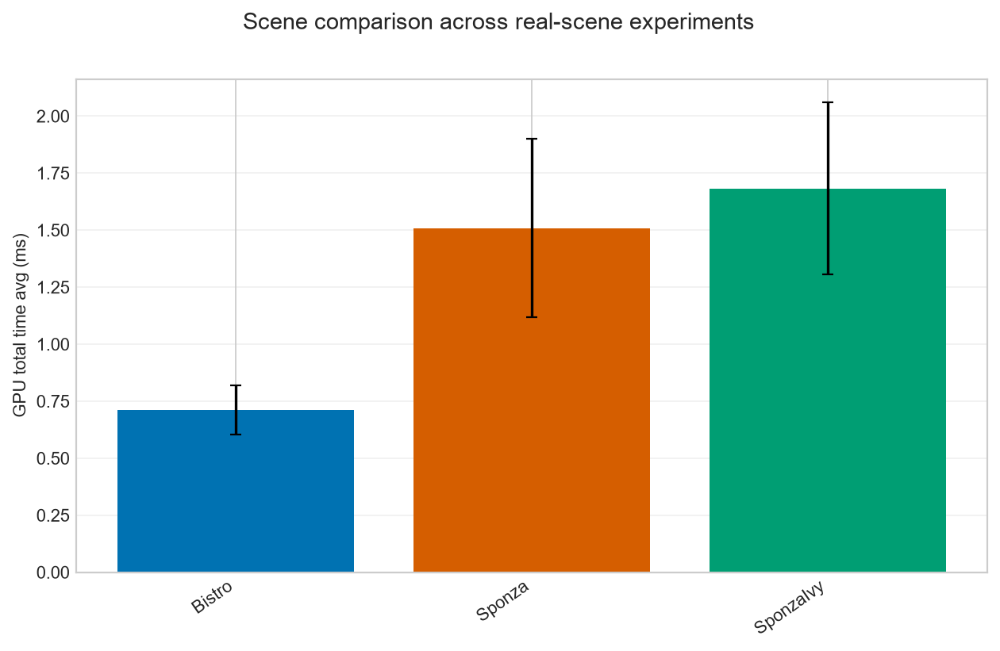

- Inputs: `20_real_random_bin_count_quick_all_scenes.json;21_real_random_diversity_quick_all_scenes.json;22_real_pbr_feature_renderer_compare_full.json;23_real_random_selected_renderer_compare_quick.json;24_real_resolution_scaling_pbr_quick.json;25_real_texture_vfc_ablation_quick.json;30_final_selected_full_camera.json`
- Filters: success rows; aggregates heterogeneous experiment families
- X axis: scene
- Series: mean ± population std
- SVG: [scene_comparison.svg](svg/scene_comparison.svg)

### Synthetic experiment family overview

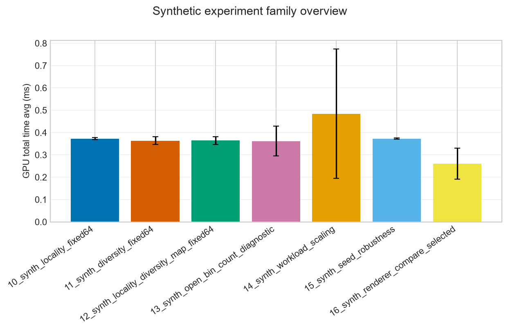

- Inputs: `10_synth_locality_fixed64.json;11_synth_diversity_fixed64.json;12_synth_locality_diversity_map_fixed64.json;13_synth_open_bin_count_diagnostic.json;14_synth_workload_scaling.json;15_synth_seed_robustness.json;16_synth_renderer_compare_selected.json`
- Filters: success rows; mean ± std per experiment
- X axis: experiment config
- Series: mean ± population std
- SVG: [synthetic_combined.svg](svg/synthetic_combined.svg)

### Real-scene experiment family overview

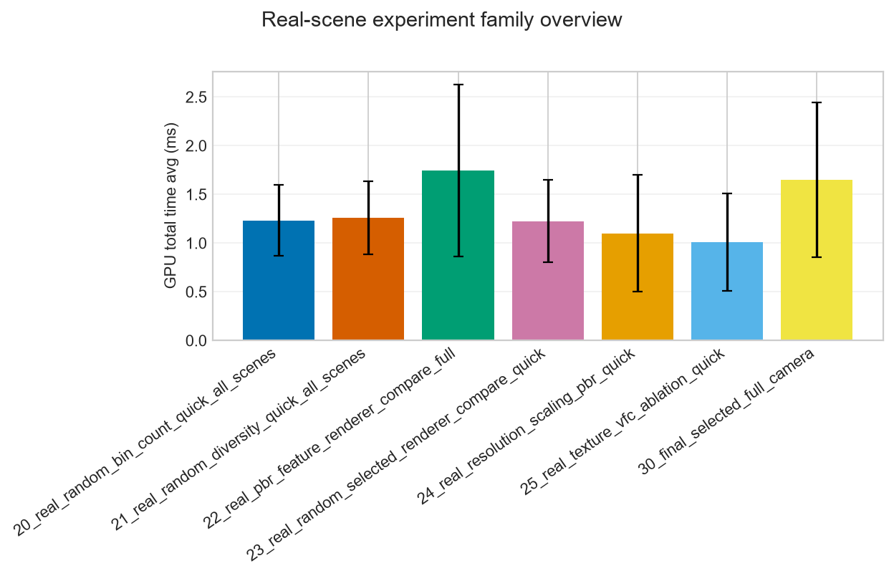

- Inputs: `20_real_random_bin_count_quick_all_scenes.json;21_real_random_diversity_quick_all_scenes.json;22_real_pbr_feature_renderer_compare_full.json;23_real_random_selected_renderer_compare_quick.json;24_real_resolution_scaling_pbr_quick.json;25_real_texture_vfc_ablation_quick.json;30_final_selected_full_camera.json`
- Filters: success rows; mean ± std per experiment
- X axis: experiment config
- Series: mean ± population std
- SVG: [real_scene_combined.svg](svg/real_scene_combined.svg)

### Major pass timing breakdown — final full-camera runs

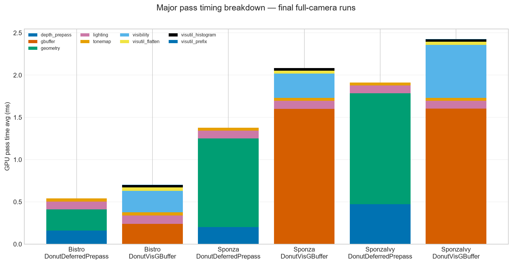

- Inputs: `30_final_selected_full_camera.json`
- Filters: pass slot 0 total excluded; success rows only
- X axis: scene × renderer
- Series: named GPU pass
- SVG: [pass_timing_breakdown.svg](svg/pass_timing_breakdown.svg)

### Total-time average / median / p90 / p99

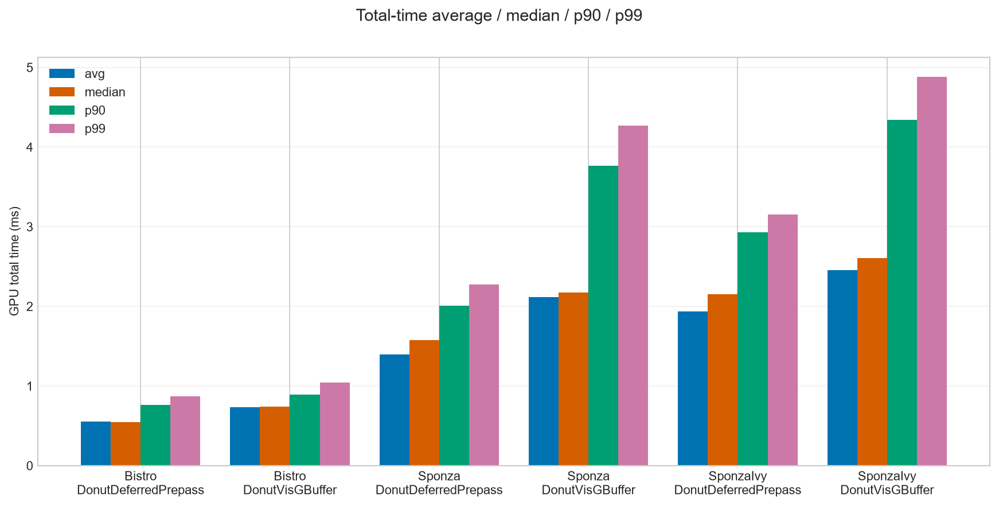

- Inputs: `30_final_selected_full_camera.json`
- Filters: final full-camera success rows
- X axis: scene × renderer
- Series: ProgramResult total-time statistic
- SVG: [total_time_statistics.svg](svg/total_time_statistics.svg)

### Campaign success / salvaged / failed / skipped counts

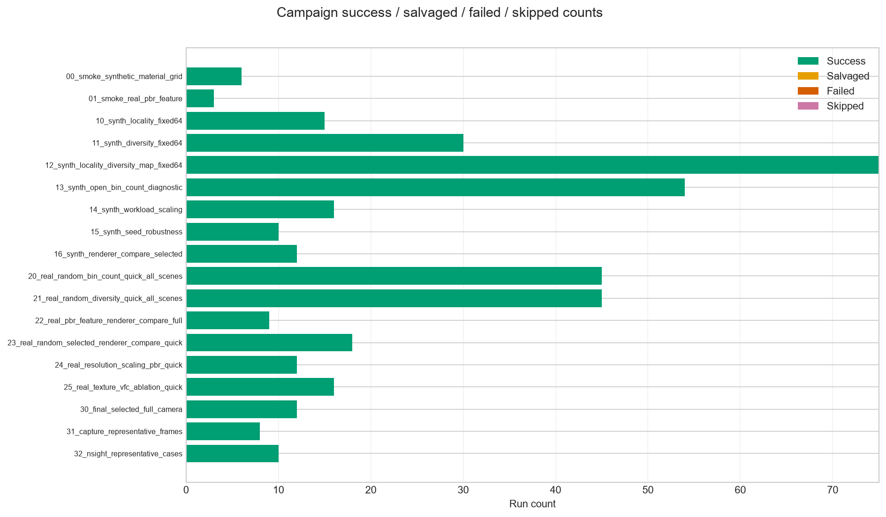

- Inputs: `00_smoke_synthetic_material_grid.json;01_smoke_real_pbr_feature.json;10_synth_locality_fixed64.json;11_synth_diversity_fixed64.json;12_synth_locality_diversity_map_fixed64.json;13_synth_open_bin_count_diagnostic.json;14_synth_workload_scaling.json;15_synth_seed_robustness.json;16_synth_renderer_compare_selected.json;20_real_random_bin_count_quick_all_scenes.json;21_real_random_diversity_quick_all_scenes.json;22_real_pbr_feature_renderer_compare_full.json;23_real_random_selected_renderer_compare_quick.json;24_real_resolution_scaling_pbr_quick.json;25_real_texture_vfc_ablation_quick.json;30_final_selected_full_camera.json;31_capture_representative_frames.json;32_nsight_representative_cases.json`
- Filters: all runner statuses, including non-measurement cases
- X axis: run count
- Series: runner status
- SVG: [status_summary.svg](svg/status_summary.svg)
